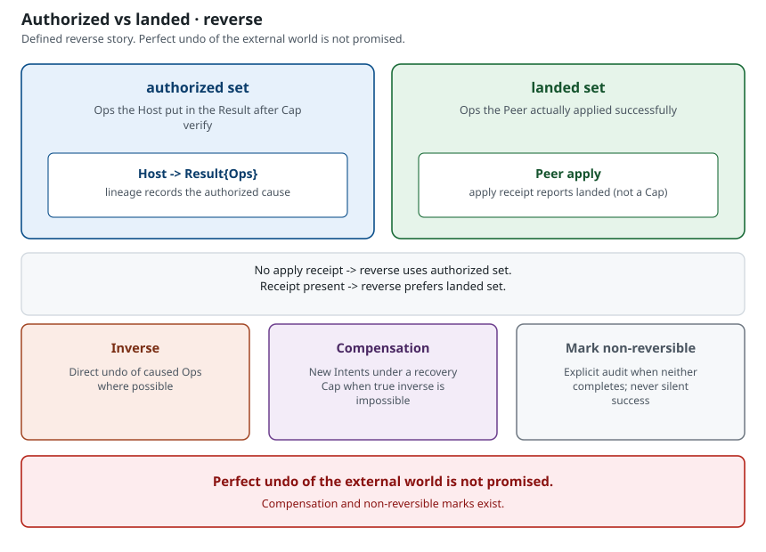
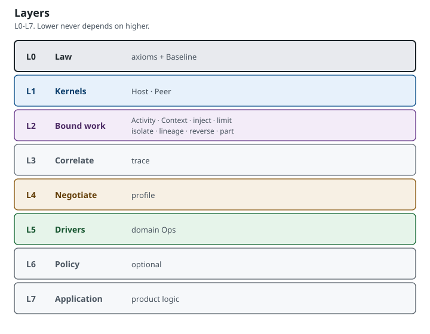

# EXPLAIN — why the splits

This page is **explanation** (why, not how). It is not a tutorial, not a how-to, and not a second axiom book.

- Axioms: [LAW.md §2](LAW.md#2-axioms)
- Names: [VOCABULARY.md](VOCABULARY.md)
- Alignment: [KILL.md](KILL.md)
- Freeze and amendment: [CHARTER.md](CHARTER.md)
- Walk: [START.md](START.md)

Do not invent axioms here. Do not copy [LAW.md §2](LAW.md#2-axioms) into another table.

---

## Why Cap-only

Ambient authority is the failure. If being “in the room” is enough to change a shared world, revoke has nothing to bind.

**Cap** is permission to submit a class of Intent. A session, receipt, or **trace** is not that permission.

[LAW.md §1](LAW.md#1-definition) names the problem. The constitutional answer is [LAW.md §2](LAW.md#2-axioms) (A1) — read it there; this page does not copy that table.

Alignment gates: [KILL.md K1](KILL.md#instant-disqualification); [KILL.md K4](KILL.md#instant-disqualification) if **trace** is treated as permission.

Bootstrap is the documented origin of Caps, not a standing second path: [LAW.md §14](LAW.md#14-bootstrap). Widening it is a [CHARTER.md](CHARTER.md) amendment.

---

## Why Ops-only

Free side-effects are the failure. If mutation happens off the list, **reverse** has no authorized set to walk.

Carry-out is listed as ordered **Ops** in a **Result** ([LAW.md §6](LAW.md#6-intent-result-ops)). That list is data, not the language name ([VOCABULARY.md](VOCABULARY.md)).

[LAW.md §1](LAW.md#1-definition) names the problem. The constitutional answer is [LAW.md §2](LAW.md#2-axioms) (A2) — read it there; this page does not copy that table.

Alignment gate: [KILL.md K2](KILL.md#instant-disqualification).

---

## Why Host ≠ Peer

Decide vs apply collapse is the failure. If one privileged role both allows the change and carries it out, that side can mint or invent truth.

[LAW.md §4](LAW.md#4-host-and-peer) splits the duties: **Host** verifies Cap, decides, returns Result; **Peer** applies Ops.

Pedagogical submit / apply order (not law): [PSEUDOCODE.md](PSEUDOCODE.md).

The constitutional answer is [LAW.md §2](LAW.md#2-axioms) (A7). Collapsing Host and Peer into one privileged role requires a [CHARTER.md](CHARTER.md) amendment.

Alignment gate: [KILL.md K3](KILL.md#instant-disqualification).

Placement across processes and devices: [TOPOLOGY.md](TOPOLOGY.md).

---

## Why trace ≠ Activity

Permission-as-correlation is the failure. If a grouping id is treated as permission, expired Caps come back to life.

**trace** correlates Intents. **Activity** bounds work and owns reverse on end. **Cap** is permission. They answer different questions; this page does not copy the comparison table.

Read the comparison in [VOCABULARY.md — Cap vs trace vs Activity](VOCABULARY.md#cap-vs-trace-vs-activity). Law: [LAW.md §8](LAW.md#8-activity-and-context), [LAW.md §10](LAW.md#10-trace), and [LAW.md §2](LAW.md#2-axioms) (A6).

Treating a trace as permission or as execute fails [KILL.md K4](KILL.md#instant-disqualification). Ending work still reverses **lineage** under Activity / Cap, not under a trace: [LAW.md §9](LAW.md#9-lineage-and-reverse).

---

## Why reverse ≠ perfect undo

Fake perfect undo is the failure. Saying the change is fully undone when the external world cannot invert hides leftover change.

End and revoke need a defined reverse story — inverse, compensation under a recovery Cap, or an explicit non-reversible mark. That story is not a promise of perfect undo of the external world.

Read the guarantee and the non-guarantee in [CHARTER.md Stability guarantees](CHARTER.md#stability-guarantees) and [Stability non-guarantees](CHARTER.md#stability-non-guarantees). Forms: [LAW.md §9](LAW.md#9-lineage-and-reverse) and [LAW.md §13 Recovery Cap](LAW.md#13-recovery-cap).

Silent “fully reversed” when inverse/compensation failed is a kill: [KILL.md K12](KILL.md#soft-fail).

---

## Why Baseline permanence

Flag-day break is the failure. Silently dropping ability for correct old Host/Peer pairs splits the shared contract overnight.

**Baseline** is the permanent shared contract every correct pair supports.

[LAW.md §1](LAW.md#1-definition) names that problem; [LAW.md §11](LAW.md#11-baseline-profile-negotiation) is the contract. The constitutional answer is [LAW.md §2](LAW.md#2-axioms) (A4) — read it there; this page does not copy that table.

Silently breaking Baseline for correct old Host/Peer pairs fails [KILL.md K9](KILL.md#instant-disqualification). Breaking Baseline interop requires a [CHARTER.md](CHARTER.md) amendment.

---

## Layers

Lower never depends on higher. Domain drivers live at L5; they are not Hosts.

The stack is [LAW.md §3](LAW.md#3-layers). This page does not restate it.

---

## Next

- Tutorial walk: [START.md](START.md)
- Topology / multiplicity: [TOPOLOGY.md](TOPOLOGY.md)
- Map: [README.md](README.md)
- How-to: [HOWTO-ALIGN.md](HOWTO-ALIGN.md) · [HOWTO-NAME.md](HOWTO-NAME.md) · [HOWTO-AMEND.md](HOWTO-AMEND.md)
- Law: [LAW.md](LAW.md)
