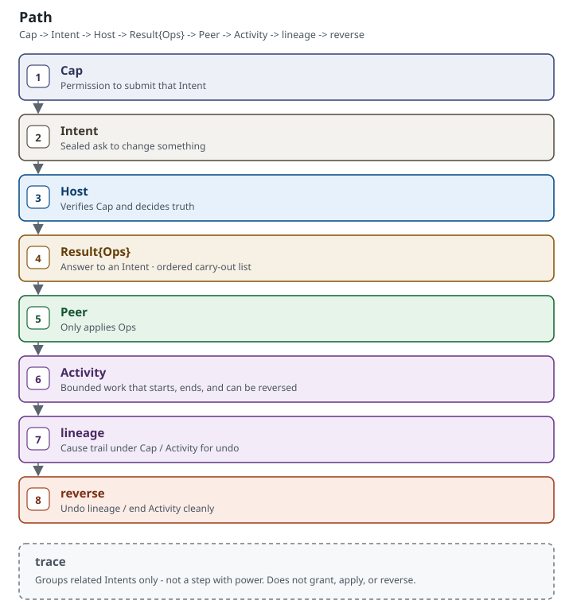
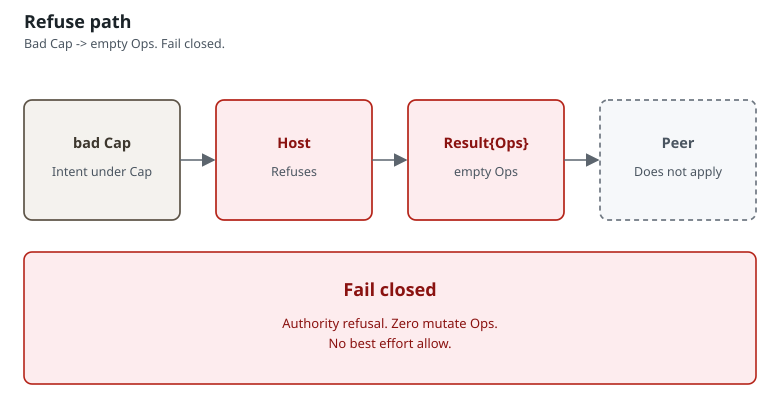
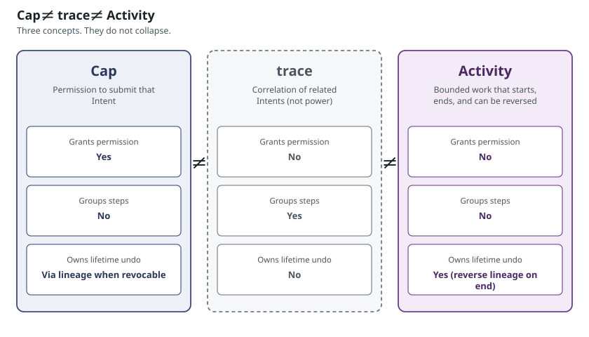

# START — five minutes on the Path

This is a **tutorial**. It walks the Path. It does not restate axioms and it is not a second axiom book.

Constitutional statements live only in [LAW.md §2](LAW.md#2-axioms). Names: [VOCABULARY.md](VOCABULARY.md). Alignment: [KILL.md](KILL.md). Freeze and amendment: [CHARTER.md](CHARTER.md).

When you finish, you can answer three questions **by following the links** — without reading all of LAW.md.

---

## Three questions (answer by link)

**(a) Who may change a shared world**

- [LAW.md §5 Cap](LAW.md#5-cap)
- [VOCABULARY.md — Cap](VOCABULARY.md#frozen-nouns)
- Alignment gate: [KILL.md K1](KILL.md#instant-disqualification)
- Axiom: [LAW.md §2](LAW.md#2-axioms) (A1). Read it there.

**(b) How the change is listed**

- [LAW.md §6 Intent, Result, Ops](LAW.md#6-intent-result-ops)
- [VOCABULARY.md — Ops](VOCABULARY.md#frozen-nouns) · [apply](VOCABULARY.md#frozen-verbs)
- Alignment gate: [KILL.md K2](KILL.md#instant-disqualification)
- Axiom: [LAW.md §2](LAW.md#2-axioms) (A2). Read it there.

**(c) How it is undone**

- [LAW.md §9 Lineage and reverse](LAW.md#9-lineage-and-reverse)
- [VOCABULARY.md — lineage](VOCABULARY.md#frozen-nouns) · [reverse](VOCABULARY.md#frozen-verbs)
- Alignment gates: [KILL.md K11, K12](KILL.md#soft-fail)
- Defined reverse story, **not** perfect undo of the external world: [CHARTER.md Stability guarantees](CHARTER.md#stability-guarantees) and [Stability non-guarantees](CHARTER.md#stability-non-guarantees)

---

## Walk the Path

Use frozen names. Gloss is once, here; it does not mint a second official language ([VOCABULARY.md](VOCABULARY.md)).

**Path.** Mint Cap → submit Intent → Host verify → Result{Ops} → Peer apply → Activity bounds work → lineage records causes → end/revoke → reverse (or mark non-reversible) → trace groups steps only.

1. **Cap** — mint. Permission to submit a class of Intent. [LAW.md §5](LAW.md#5-cap) · [VOCABULARY.md](VOCABULARY.md#frozen-nouns)
2. **Intent** — submit a sealed ask under that Cap. [LAW.md §6](LAW.md#6-intent-result-ops) · [VOCABULARY.md](VOCABULARY.md#frozen-nouns)
3. **Host verify** — Host verifies the Cap (pipeline before shared-world effects). [LAW.md §4](LAW.md#4-host-and-peer) · [KILL.md K5](KILL.md#instant-disqualification) · [Host ≠ Peer](diagrams/02-host-peer.svg)
4. **Result{Ops}** — Host returns a Result whose carry-out list is ordered **Ops** (data, not the language name). [LAW.md §6](LAW.md#6-intent-result-ops) · [VOCABULARY.md](VOCABULARY.md)
5. **Peer apply** — Peer carries out those Ops. Peer is not Host. [LAW.md §4](LAW.md#4-host-and-peer) · [KILL.md K3](KILL.md#instant-disqualification) · [Host ≠ Peer](diagrams/02-host-peer.svg)
6. **Activity** — bounded work: opens, runs, ends. [LAW.md §8](LAW.md#8-activity-and-context) · [VOCABULARY.md](VOCABULARY.md#frozen-nouns)
7. **lineage** — cause trail under Cap / Activity. [LAW.md §9](LAW.md#9-lineage-and-reverse) · [VOCABULARY.md](VOCABULARY.md#frozen-nouns)
8. **reverse (or mark)** — on end or revoke, reverse the lineage; if inverse and compensation cannot complete, mark non-reversible. Never silent success. [LAW.md §9](LAW.md#9-lineage-and-reverse) · [LAW.md §13 Recovery Cap](LAW.md#13-recovery-cap) · [KILL.md K12](KILL.md#soft-fail) · [CHARTER.md non-guarantees](CHARTER.md#stability-non-guarantees) · [authorized vs landed](diagrams/04-authorized-landed-reverse.svg)

---

## Cap ≠ trace ≠ Activity

These three are not interchangeable. Read the comparison; this page does not copy it.

- [VOCABULARY.md — Cap vs trace vs Activity](VOCABULARY.md#cap-vs-trace-vs-activity)
- [LAW.md §5](LAW.md#5-cap) · [LAW.md §8](LAW.md#8-activity-and-context) · [LAW.md §10 Trace](LAW.md#10-trace)
- Alignment gate if a trace is treated as permission: [KILL.md K4](KILL.md#instant-disqualification)

---

## Next

- Why the splits exist: [EXPLAIN.md](EXPLAIN.md) · [layers](diagrams/05-layers.svg)
- Map: [README.md](README.md)
- How-to: [HOWTO-ALIGN.md](HOWTO-ALIGN.md) · [HOWTO-NAME.md](HOWTO-NAME.md) · [HOWTO-AMEND.md](HOWTO-AMEND.md)
