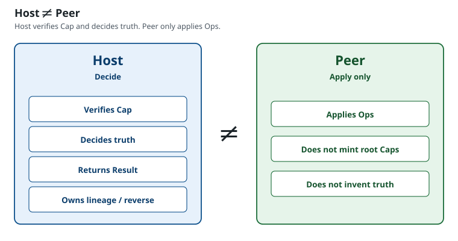

# Topology — Host / Peer multiplicity

How CEK spans processes, browsers, WASM, and hardware. Same two roles. Not a third kernel. Not a tutorial. Not a package. Not a second axiom book.

- Law: [LAW.md §4 Host and Peer](LAW.md#4-host-and-peer) · [LAW.md §11 Baseline, profile](LAW.md#11-baseline-profile-negotiation) · [LAW.md §3 Layers](LAW.md#3-layers)
- Why the split: [EXPLAIN.md — Why Host ≠ Peer](EXPLAIN.md#why-host--peer)
- Figure: [Host ≠ Peer](diagrams/02-host-peer.svg)
- Concepts: [CONCEPTS.md](CONCEPTS.md) · Practice: [PRACTICE.md](PRACTICE.md)

---

## Exactly two roles

| Role | Duty |
|------|------|
| **Host** | Decide |
| **Peer** | Apply |

L1 has **exactly two** kernels. Many Host implementations and many Peer implementations may exist. Multiplicity does not add roles.

A process may embed both roles as **separate** boundaries. **mint** must not live inside pure apply.



---

## Topology is free

Placement is free. In-process, split processes, browser, WASM, hardware — the Path does not change.

```text
Cap → Intent → Host → Result{Ops} → Peer
```

1. Mint **Cap**, then submit **Intent**.
2. **Host** verifies and returns **Result{Ops}**.
3. **Peer** applies the Ops.

Each apply boundary is still **Peer**. Each decide boundary is still **Host** (or Host-delegated under Cap). Hops do not add a third role. Lineage stays Cap/Activity-accountable across hops when revocation spans them.

---

## Device / UI / DB are not a third kernel

Device, UI, and DB are **L5** drivers on the Peer outer — domain carry-out, not Hosts, not a third L1 kernel.

Caller, bootstrap, lineage store, recovery Cap, profile, transport, and a conformance harness are not kernels.

---

## Baseline and profile

| Term | Meaning |
|------|---------|
| **Baseline** | Permanent common apply contract every correct Host/Peer pair supports |
| **profile** | What **this** Peer can apply |

Host projects `Ops ⊆ peer ability ∪ Baseline fallback`. Missing or limited profile → Baseline projection. Profile never grants Cap authority.

How a Peer encodes ability is free. That encoding is not a kernel noun. Notes (not law): [IMPLEMENTATION.md](IMPLEMENTATION.md).

---

## Cross-Host Caps

A Cap minted under one Host’s policy is **not** automatically authority on another Host. Cross-Host acceptance requires **explicit** shared verify policy. Default: separate trust domains.

---

## Next

- Why Host ≠ Peer: [EXPLAIN.md](EXPLAIN.md#why-host--peer) · [Host ≠ Peer](diagrams/02-host-peer.svg)
- Concepts: [CONCEPTS.md](CONCEPTS.md)
- Practice: [PRACTICE.md](PRACTICE.md)
- Walk: [START.md](START.md)
- Map: [README.md](README.md)
